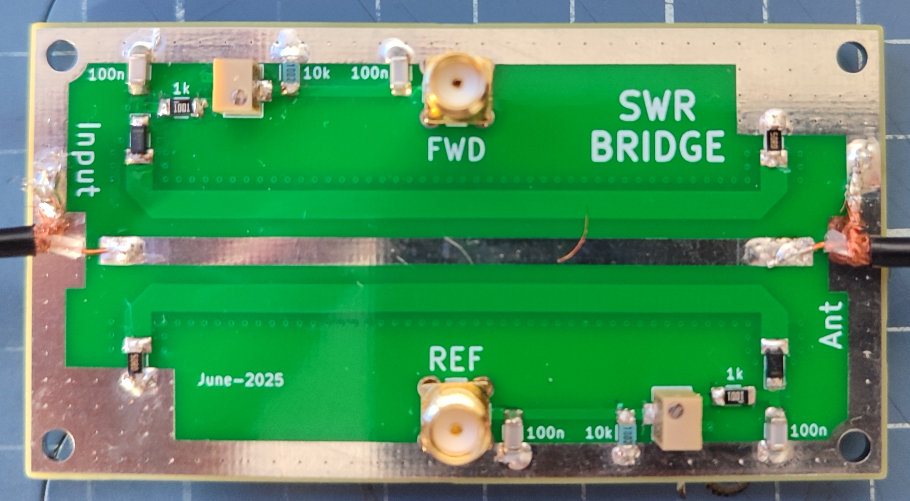

# SWR measurement board

This repo consists of a board for measuring SWR. It works up to 500mhz and 1kW of power in HF.  
The pickup lines are 20 db attenuated.  


You can connect it to an arduino and measure the FWD and reflected power.



------------------------

## BOM:

```
- PCB that you can order ar jlcpcb or somewhere else.
- 2x SMD 3224W 10k potentiometers. You can use 5k if you plan to measure low power. (https://aliexpress.com/item/1005009122898646.html)
- 2x 1206 50 ohm resistor (https://aliexpress.com/item/1005008118472536.html)
	alternatively, you can use 4x 100 ohm 1206 resistors.
- 4x 1206 100nF 200v NPO Capacitor (https://aliexpress.com/item/1005007149614327.html)
- 2x 1206 1k ohm resistor
- 2x 1206 10k ohm resistor
- 2x MMSD701T1G Diode (https://aliexpress.com/item/1005008691014348.html)
- 2x SMA SMA-KE 13.5MM connectors (https://aliexpress.com/item/1005007424915378.html)
```

------------------------

## Reading the SWR in a Arduino

**Important, this section is currently work in progress and the code might change**

You can order an arduino UNO board along with a [LCD shield](https://es.aliexpress.com/item/32475515474.html) to read the millivolts.

Before doing so, push the maximum power of your radio trough the SWR board and to a dummy load.  
While doing so, adjust the potentiometer with a multimeter so the volts in the FWD line are lower than 4.5v  
as that will avoid burning the arduino ADC.  
  
You can check the sample code for the arduino in the Arduino folder of the repo.  

------------------------

## Ordering the PCB:

Download the Gerber file from this repo and order it a jlcpcb with the default options.  
The only option I've changed is to remove the manufacture code mark


#### Please make sure to visit the [satcom radio website](https://satcomradio.github.io/) for more information